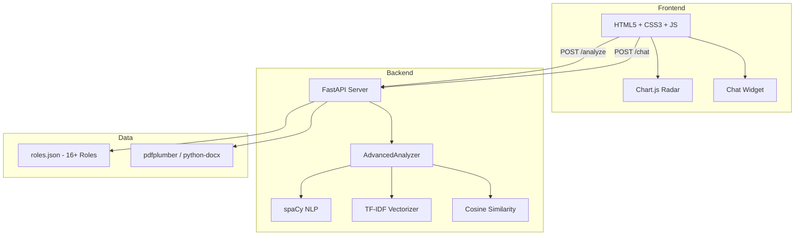

# 🤖 AI Resume Analyzer

[](https://python.org)
[](https://fastapi.tiangolo.com)
[](LICENSE)
[](https://spacy.io)

**A production-grade career intelligence system** that evaluates resumes using NLP and Machine Learning. Get ATS compatibility scores, semantic job description matching, keyword gap analysis, and AI-powered improvement suggestions — all through a stunning glassmorphic dashboard.

---


live link :- https://resume-analyzer-e8r9.onrender.com


## ✨ Features

| Feature | Description |
|---|---|
| 🎯 **ATS Scoring** | Composite score (0–100) based on skills, experience, projects, education, and keyword optimization |
| 🔍 **Semantic JD Matching** | TF-IDF + Cosine Similarity to compare your resume against any job description |
| 📊 **16+ Job Roles** | Built-in benchmarks for Software Engineer, Data Scientist, ML Engineer, DevOps, and more |
| 🏷️ **Keyword Gap Analysis** | See exactly which critical skills are missing from your resume |
| ✍️ **Bullet Rewriter** | Detects weak action verbs and suggests power-verb replacements |
| 📋 **Formatting Audit** | Checks resume length, bullet usage, and structural consistency |
| 💬 **AI Career Coach** | Chat with an AI coach that explains your score and suggests improvements |
| 📜 **Analysis History** | Track your last 5 analyses with scores across sessions |
| 🌐 **Language Detection** | Identifies English, Hindi, or other languages |
| 🎨 **Midnight Pro UI** | Premium dark glassmorphic theme with animated charts and transitions |

---

## 🚀 Quick Start

```bash
# 1. Clone the repo
git clone https://github.com/Harshitdubey-lab/Resume_analyzer.git
cd resume-analyzer

# 2. Create virtual environment
python -m venv venv
source venv/bin/activate          # Linux/Mac
# .\venv\Scripts\Activate.ps1    # Windows

# 3. Install dependencies
pip install -r requirements.txt
python -m spacy download en_core_web_sm

# 4. Run the server
python -m uvicorn backend.main:app --reload

# 5. Open http://localhost:8000
```

> 📖 For detailed setup instructions (Windows/Mac/Linux), see **[docs/SETUP_GUIDE.md](docs/SETUP_GUIDE.md)**

---

## 🏗️ Architecture



---

## 📁 Project Structure

```
resume-analyzer/
├── backend/                    # FastAPI server + NLP engine
│   ├── main.py                 # API routes, CORS, static file mount
│   ├── model.py                # AdvancedAnalyzer — scoring & chat engine
│   ├── utils.py                # Text extraction, preprocessing, section parsing
│   ├── role_data.py            # Legacy role database
│   └── roles.json              # Extended 16+ role skill database
│
├── frontend/                   # Static UI (served by FastAPI)
│   ├── index.html              # Page structure & components
│   ├── style.css               # Midnight Pro glassmorphic theme
│   └── script.js               # Application logic & Chart.js
│
├── scripts/                    # Utility scripts
│   ├── generate_report.py      # PDF report generator
│   └── start_ngrok.py          # ngrok tunnel for public access
│
├── docs/                       # Documentation
│   ├── APP_README.md           # Application features & overview
│   ├── FRONTEND.md             # Frontend architecture
│   ├── BACKEND.md              # Backend architecture & scoring
│   ├── API_REFERENCE.md        # Complete API documentation
│   ├── API_BRIDGE.md           # Frontend ↔ Backend communication
│   └── SETUP_GUIDE.md          # Installation on any device
│
├── requirements.txt
├── .gitignore
├── LICENSE                     # MIT
└── CONTRIBUTING.md
```

---

## 🔌 API Endpoints

| Method | Endpoint | Description |
|---|---|---|
| `POST` | `/analyze` | Full resume analysis — returns score, feedback, keywords |
| `POST` | `/chat` | AI career coach chatbot |
| `POST` | `/upload-resume` | Upload and extract text (standalone) |
| `GET` | `/` | Serve frontend UI |

> 📖 Full request/response schemas: **[docs/API_REFERENCE.md](docs/API_REFERENCE.md)**

---

## 📊 Scoring Methodology

| Component | Points | What It Measures |
|---|---|---|
| Skills | 30 | Presence of a skills section |
| Experience | 25 | Depth of work experience (>100 words = full) |
| Projects | 20 | Presence of project descriptions |
| Education | 15 | Educational background |
| ATS Match | 10 | Semantic similarity with role/JD |
| **Total** | **100** | |

---

## 🛠️ Tech Stack

| Layer | Technology |
|---|---|
| **Backend** | Python · FastAPI · Uvicorn |
| **NLP** | spaCy · scikit-learn (TF-IDF) |
| **File Parsing** | pdfplumber · python-docx |
| **Frontend** | HTML5 · CSS3 · Vanilla JS · Chart.js |
| **Typography** | Google Fonts (Outfit) |
| **Language Detection** | langdetect |

---

## 📖 Documentation

| Document | Description |
|---|---|
| [APP_README.md](docs/APP_README.md) | Features, supported roles, limitations |
| [SETUP_GUIDE.md](docs/SETUP_GUIDE.md) | Clone-to-run installation guide |
| [FRONTEND.md](docs/FRONTEND.md) | UI architecture, components, design system |
| [BACKEND.md](docs/BACKEND.md) | Server architecture, NLP pipeline, scoring |
| [API_REFERENCE.md](docs/API_REFERENCE.md) | Every endpoint with examples |
| [API_BRIDGE.md](docs/API_BRIDGE.md) | How frontend talks to backend |

---

## 🤝 Contributing

Contributions are welcome! See [CONTRIBUTING.md](CONTRIBUTING.md) for the fork → branch → PR workflow.

---

## 📄 License

This project is licensed under the **MIT License** — see [LICENSE](LICENSE) for details.
