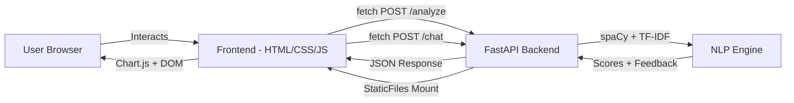
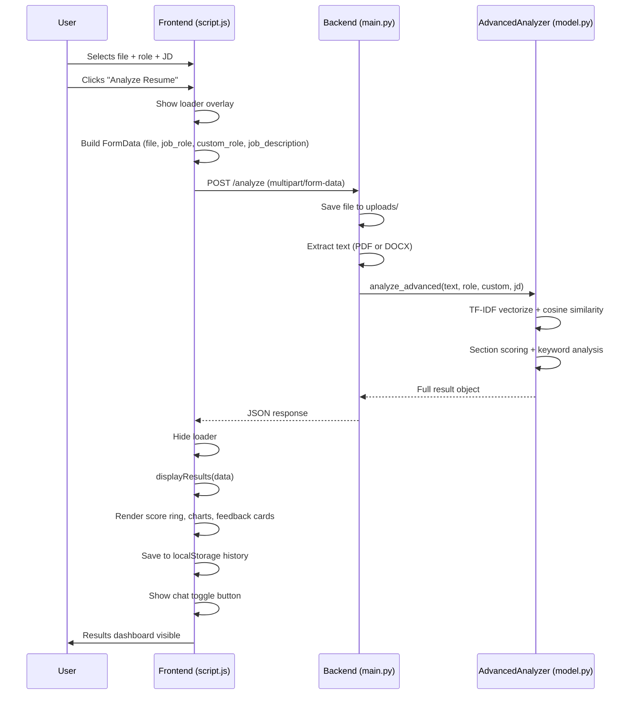
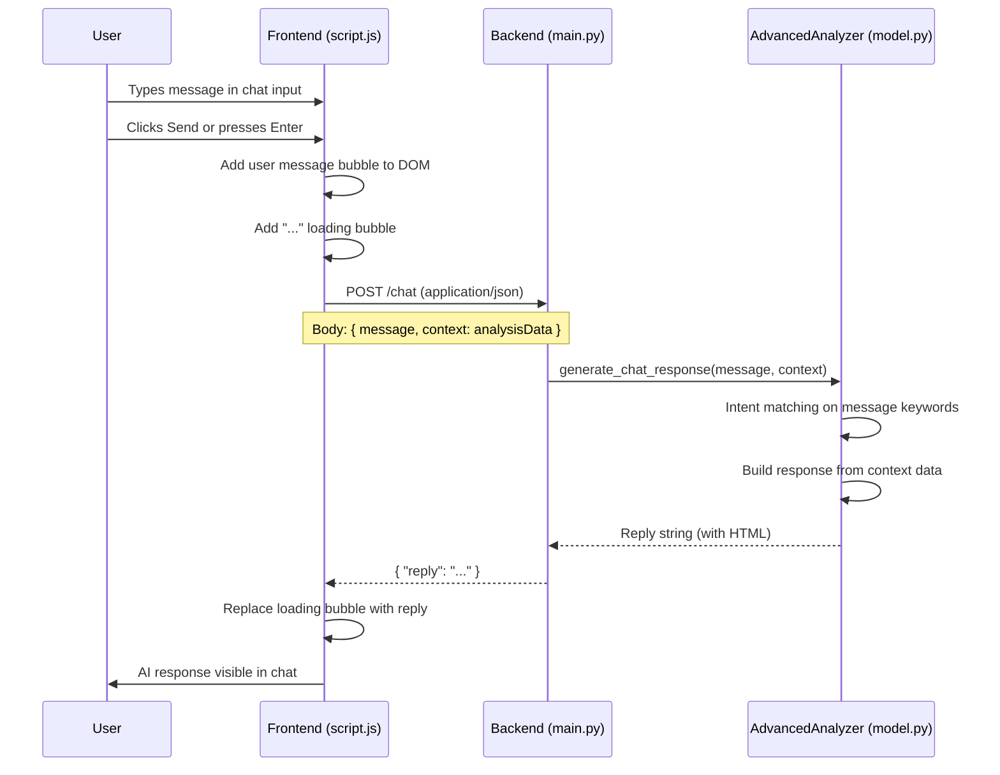

# API Bridge — Frontend ↔ Backend Communication

> How the frontend talks to the backend: request flows, data contracts, error handling, and static file serving.

## Architecture Overview



**Key Principle**: The frontend is served BY the backend. FastAPI mounts `frontend/` as static files at `/`, so everything runs on `http://localhost:8000` — no separate frontend server needed.

---

## Communication Protocol

| Aspect | Detail |
|---|---|
| **Transport** | HTTP/1.1 over localhost:8000 |
| **Format** | JSON responses, FormData or JSON requests |
| **Auth** | None (no authentication layer) |
| **CORS** | Allow all origins (`*`) |
| **Error Format** | FastAPI default: `{ "detail": "error message" }` |

---

## Request Flow 1: Resume Analysis

This is the primary user flow — uploading and analyzing a resume.



### Frontend Code (script.js)

**Building the request** (lines 66–78):
```javascript
const formData = new FormData();
formData.append('file', selectedFile);
formData.append('job_role', selectedRole);

if (selectedRole === 'other' && customRoleInput.value.trim() !== '') {
    formData.append('custom_role', customRoleInput.value.trim());
}

if (jdInput.value.trim() !== '') {
    formData.append('job_description', jdInput.value.trim());
}
```

**Sending the request** (lines 80–96):
```javascript
const response = await fetch('http://localhost:8000/analyze', {
    method: 'POST',
    body: formData
});
const data = await response.json();
displayResults(data);
```

### Backend Handler (main.py)

**Receiving and processing** (lines 44–66):
```python
@app.post("/analyze")
async def analyze_resume(
    file: UploadFile = File(...),
    job_description: str = Form(None),
    job_role: str = Form("software_engineer"),
    custom_role: str = Form(None)
):
    # Save file → Extract text → Analyze → Return result
    result = analyzer.analyze_advanced(text, job_role, custom_role, job_description)
    return result
```

---

## Request Flow 2: Chat Conversation

Triggered after analysis, when the user interacts with the chat widget.



### Data Contract

**Request**:
```json
{
  "message": "What skills am I missing?",
  "context": { /* entire /analyze response object */ }
}
```

**Response**:
```json
{
  "reply": "Based on the analysis for **software engineer**, you should focus on..."
}
```

> **Important**: The `context` field sends the **entire** analysis response back to the backend. This allows the chat engine to reference scores, missing keywords, and feedback without re-analyzing.

---

## Static File Serving

The frontend is not a separate server. FastAPI serves it directly:

```python
# In main.py — mounted LAST to not override API routes
app.mount("/", StaticFiles(directory="frontend", html=True), name="static")
```

**How it works**:
1. User navigates to `http://localhost:8000`
2. FastAPI checks registered routes first (`/analyze`, `/chat`, `/upload-resume`)
3. No match → falls through to `StaticFiles` mount
4. Serves `frontend/index.html` (because `html=True`)
5. Browser loads `style.css` and `script.js` from same origin

**Why this matters**: No CORS issues for the static files themselves. API calls from `script.js` go to the **same origin** (`localhost:8000`), though the code uses the full URL `http://localhost:8000/analyze`.

---

## Error Handling

### Frontend Error Handling

```javascript
try {
    const response = await fetch('http://localhost:8000/analyze', { ... });
    if (!response.ok) throw new Error('Analysis failed');
    const data = await response.json();
    displayResults(data);
} catch (error) {
    console.error(error);
    alert('Error analyzing resume.');
} finally {
    loader.classList.add('hidden');  // Always hide loader
}
```

- Non-OK responses trigger an alert
- Network failures caught by try/catch
- Loader is always hidden in `finally` block

### Chat Error Handling

```javascript
} catch (error) {
    const loadingMsg = document.getElementById(loadingId);
    if (loadingMsg) loadingMsg.innerHTML = "Sorry, I'm having trouble connecting right now.";
}
```

- Replaces the loading "..." bubble with an error message
- Does not show an alert (less disruptive UX)

---

## Endpoint Usage Map

| Endpoint | Frontend Trigger | Frontend Function | UI Update |
|---|---|---|---|
| `POST /analyze` | "Analyze Resume" button click | `analyzeBtn.click` handler | Full results dashboard |
| `POST /chat` | Chat send button or Enter key | `sendChatMessage()` | New chat message bubble |
| `POST /upload-resume` | **Not used by frontend** | — | — |
| `GET /` | Page load | Browser navigation | Serves `index.html` |
